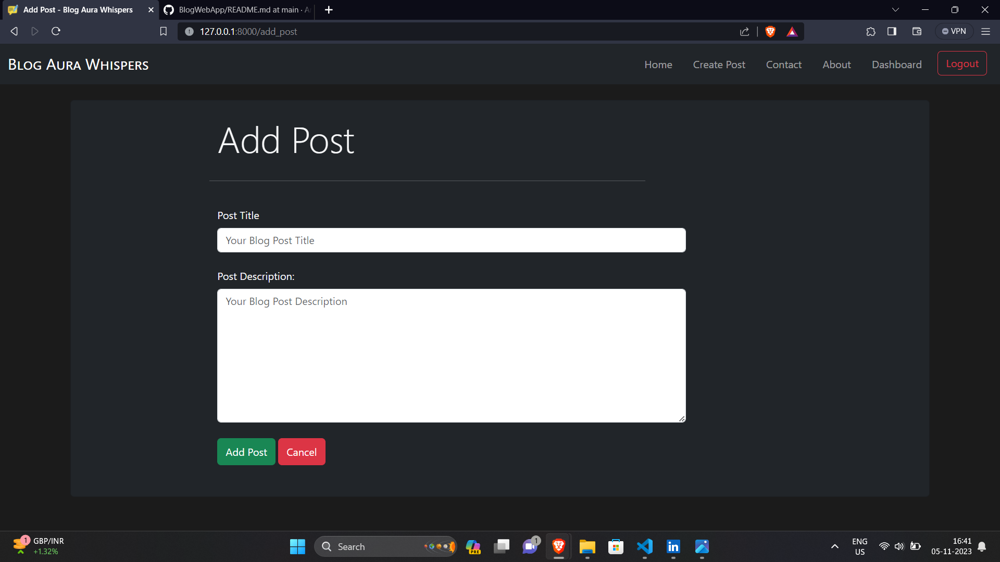

# BlogWebApp


This Blog Web Application is a Django-based web app that allows users to create, edit, and manage their blog posts. Users can sign up, log in, and access their personal dashboard to write and publish their articles.


## Features
- User registration and authentication.
- Create, edit, and delete blog posts.
- Dashboard for users to manage their posts.
- Contact form for users to send feedback or inquiries.

## Prerequisites

Before you get started, ensure you have the following requirements:

- [Python](https://www.python.org/downloads/) (3.6 or higher)
- [Django](https://docs.djangoproject.com/en/3.2/topics/install/) (3.2 or higher)


## Installing Dependencies

Before running the project, make sure to install the required Python packages listed in `requirements.txt`. Since we haven't uploaded certain files (e.g., Tailwind CSS library and Node modules), you will need to set up the front-end dependencies.


1. Clone this repository to your local machine:

```shell
git clone https://github.com/Arslanamin404/BlogWebApp.git
```

2. Create a virtual environment (optional but recommended):

```bash
python -m venv venv
```

Activating virtual environment On Windows: 
```bash
venv\Scripts\activate
```

Activating virtual environment On Mac: 
```bash 
source venv/bin/activate
```


3. Install Python packages `*`: 
  ```bash
 pip install -r requirements.txt
```


## Running the Project

 Now that you have installed the necessary dependencies, you can run the Django development server to start the project.

1. Apply database migrations:
```bash
    python manage.py makemigrations
    python manage.py migrate
```


2. Start the development server:
```bash
  python manage.py runserver
```


## Screenshots





## Author

- [Mohammad Arsalan Rather](https://github.com/Arslanamin404) - Project Author


## Contact

For any questions, issues, or inquiries about the project, you can reach out to [futuregen.jk@gmail.com](mailto:futuregen.jk@gmail.com).


## Additional Information

- This project is meant for educational purposes and as a starting point for Django-based web applications.
- Feel free to customize and expand upon this project to meet your specific needs and requirements.


## Thanks For Visiting!
